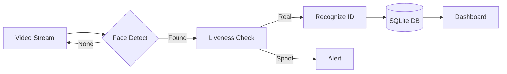
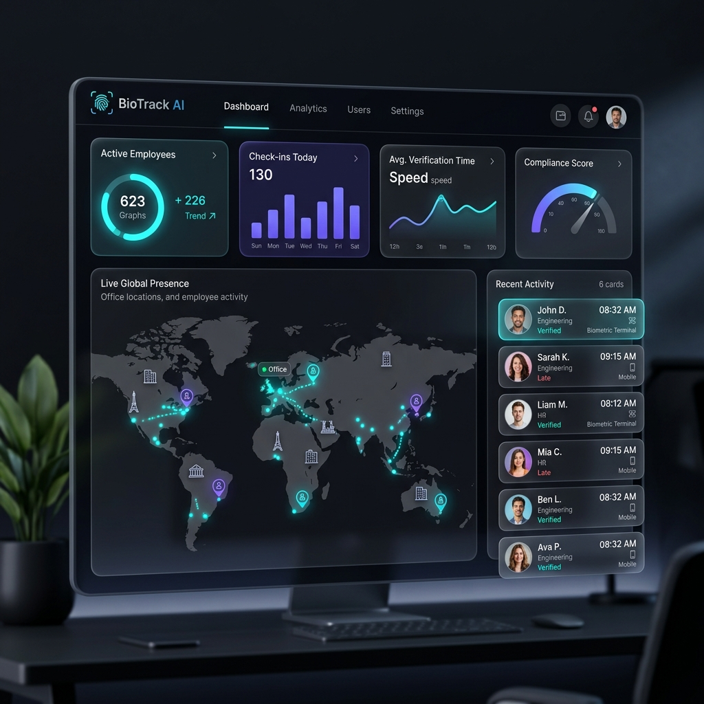

<div align="center">


<br/>

[](https://github.com/Sofzenix/Smart-Attendance-System)
[](https://python.org)
[](https://github.com/Sofzenix/Smart-Attendance-System)
[](LICENSE)

<br/>


**Experience the future of workplace management.**
*AI-driven Face Identification • Real-time Anti-Spoofing • Executive Analytics*

---

[Features](#features) • [Deployment](#deployment) • [Logic](#logic) • [Vision](#vision)

</div>

---

## Elite Features

| | |
| :--- | :--- |
|  Neural Identification | High-precision face matching using LBPH algorithms, optimized for varying lighting and angles. |
|  Liveness Guardian | Advanced blink detection and depth-of-field verification to prevent known spoofing. |
|  Executive Analytics | Glassmorphism-style dashboards featuring real-time attendance trends and departmental heatmaps. |
|  Seamless Integration | One-click export to CSV/JSON, compatible with global ERP systems. |

---

## Logic Architecture



---

## Deployment

```bash
# Clone
git clone https://github.com/Sofzenix/Smart-Attendance-System.git
cd Smart-Attendance-System

# Environment
python -m venv venv
source venv/bin/activate  # Windows: venv\Scripts\activate

# Install & Launch
pip install -r requirements.txt
python app.py
```

---

## Interface Preview


*High-end SaaS Management Dashboard.*

---

## Vision Roadmap

- **Thermal Integration**: High-accuracy temperature scanning during check-in.
- **Decentralized Sync**: Encrypted peer-to-peer data synchronization.
- **Mobile Edge**: NFC and FaceID from mobile units.

---

<div align="center">

### Designed for Excellence
Built by **Sofzenix Technologies**

[Website](https://sofzenix.tech) • [Support](mailto:support@sofzenix.tech)

</div>
