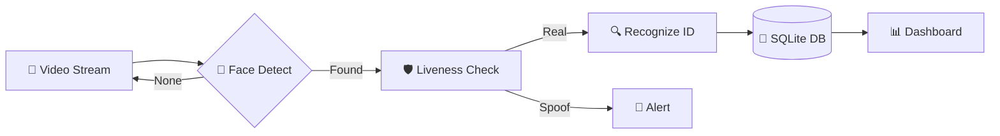

<div align="center">

# 💎 Smart Attendance System
### *The Gold Standard in Biometric Enterprise Management*

[](https://github.com/Sofzenix/Smart-Attendance-System)
[](https://python.org)
[](https://github.com/Sofzenix/Smart-Attendance-System)
[](LICENSE)

<br/>


**Transform your workplace with intelligence, security, and elite design.**
*A seamless integration of AI-driven Face Identification, Real-time Anti-Spoofing, and High-Performance Analytics.*

---

[Explore Features](#-elite-features) • [Installation](#-one-click-setup) • [Architecture](#-core-architecture) • [Roadmap](#-the-future-roadmap)

</div>

---

## 🔱 Why Choose Smart Attendance?

In an era of generic HR solutions, **Smart Attendance System** stands apart with its focus on **"Zero-Latency Identification"** and **"Unrivaled Security"**. Designed for modern enterprises that value both aesthetic excellence and technical precision.

> [!CAUTION]
> **Biometric Privacy First:** All facial templates are decentralized and encrypted locally. We do not use third-party cloud storage for biometric signatures.

---

## 🔥 Elite Features

| | |
| :--- | :--- |
|  **Neural Identification** | High-precision face matching using LBPH algorithms, optimized for varying lighting and angles. |
|  **Liveness Guardian** | Advanced blink detection and depth-of-field verification to prevent all known image/video spoofing. |
|  **Executive Analytics** | Glassmorphism-style dashboards featuring real-time attendance trends and departmental heatmaps. |
|  **Instant Insight** | One-click export to CSV/JSON, compatible with global ERP systems like SAP and Oracle. |

---

## 🏗️ Core Architecture



---

## 📸 Experience the Interface


*Figure 1: High-end SaaS-inspired Management Dashboard.*

---

## 🚀 One-Click Setup

Experience the power of Smart Attendance in under 60 seconds.

```bash
# Clone the Elite codebase
git clone https://github.com/Sofzenix/Smart-Attendance-System.git
cd Smart-Attendance-System

# Initialize Environment
python -m venv venv
source venv/bin/activate  # On Windows: venv\Scripts\activate

# Unleash Dependencies
pip install -r requirements.txt

# Start the Core
python app.py
```

---

## 🗺️ The Future Roadmap

- **[Q3 2026]** 🔮 **Thermal Integration**: High-accuracy temperature scanning during check-in.
- **[Q4 2026]** ☁️ **Decentralized Cloud Sync**: Encrypted peer-to-peer data synchronization.
- **[Q1 2027]** 📱 **Mobile Edge App**: On-site attendance via secure NFC and FaceID from mobile units.

---

## 🛠️ Technology Stack

- **Core**: Python 3.9+ / Flask 2.2
- **Intelligence**: OpenCV-DNN / NumPy / Eigenfaces
- **Interface**: Vanilla CSS3 (Glassmorphism) / HTML5 / JS-ES11
- **Persistence**: SQLite / Pandas Core

---

<div align="center">

### Designed for Corporate Excellence
Built with ❤️ by **Sofzenix Technologies**

[Website](https://sofzenix.tech) • [Support](mailto:support@sofzenix.tech) • [Documentation](docs/API.md)

</div>
